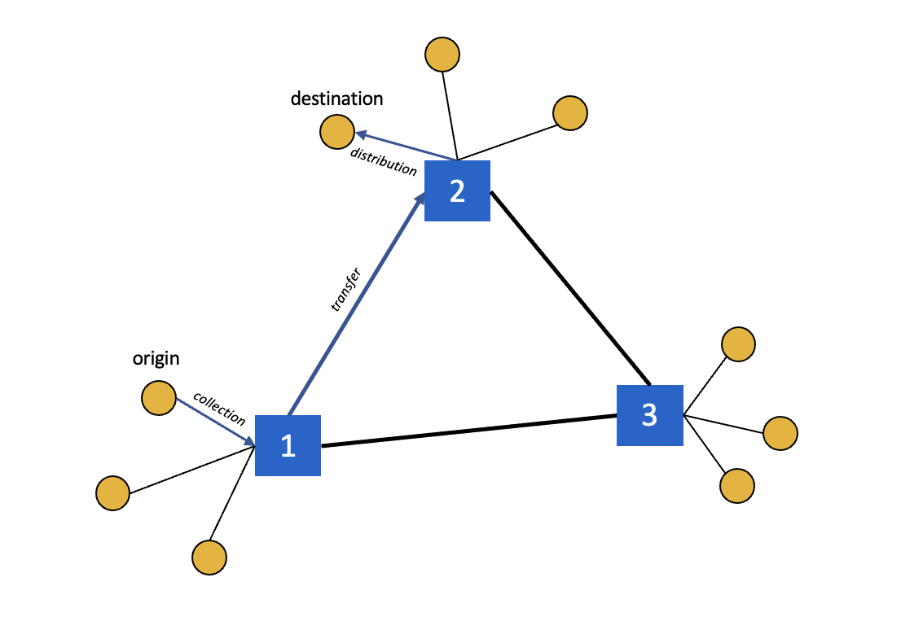
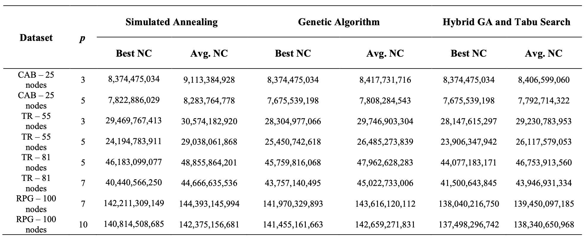

# P-Hub Location Problem Using Heuristic Approach

## Dataset
The dataset can be accessed in Dataset folder. It consists CSV files where cost as cost matrix between nodes and flow as total flow matrix between nodes.

## Code File
In this experimental setup, three computational methodologies have been employed: Simulated Annealing, Genetic Algorithm, and a Hybrid Approach.

## Steps
When developing a heuristic approach to address the p-hub median problem, it is essential to meticulously consider several key steps, which include:
- Developing Initial Solution.
- Defining how to calculate total cost.
- Defining neighbourhood structure strategy.
- Heuristic approach itself: Genetic Algorithm, Simulated Annealing, or Hybrid Approach.

## Results
Based on the results obtained, it can be deduced that the Hybrid Genetic Algorithm yields a higher degree of accuracy.

